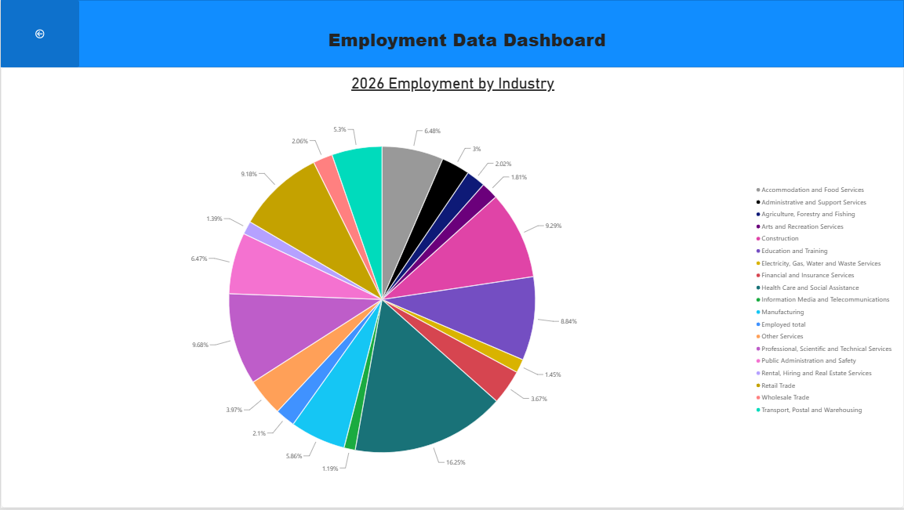

# Employment Data Dashboard

An interactive Power BI dashboard analysing over 30 years of Australian employment data across 19 industries, built to explore workforce trends, industry composition, and growth over time.

## Overview

This dashboard visualises historical employment figures sourced from the Australian Bureau of Statistics (ABS), covering monthly and quarterly employment numbers by industry from 1990 through to 2026. It was built to practice product analytics and data visualisation: turning a large, raw time series into something a non-technical stakeholder could actually explore and draw conclusions from.

## Features

- **KPI summary cards** — total current employment and the largest employing industry at a glance
- **Employment totals by industry over time** — a multi-series trend line spanning three decades
- **Detailed data table** — quarterly employment figures broken down by industry
- **Industry composition breakdown** — a proportional view of employment share by industry for a given year

## Screenshots

*KPI cards, industry trend lines, and the underlying data table*

*Employment share by industry*

## Data Source

Australian Bureau of Statistics (ABS) — Labour Force, Australia, Detailed (employment by industry).
